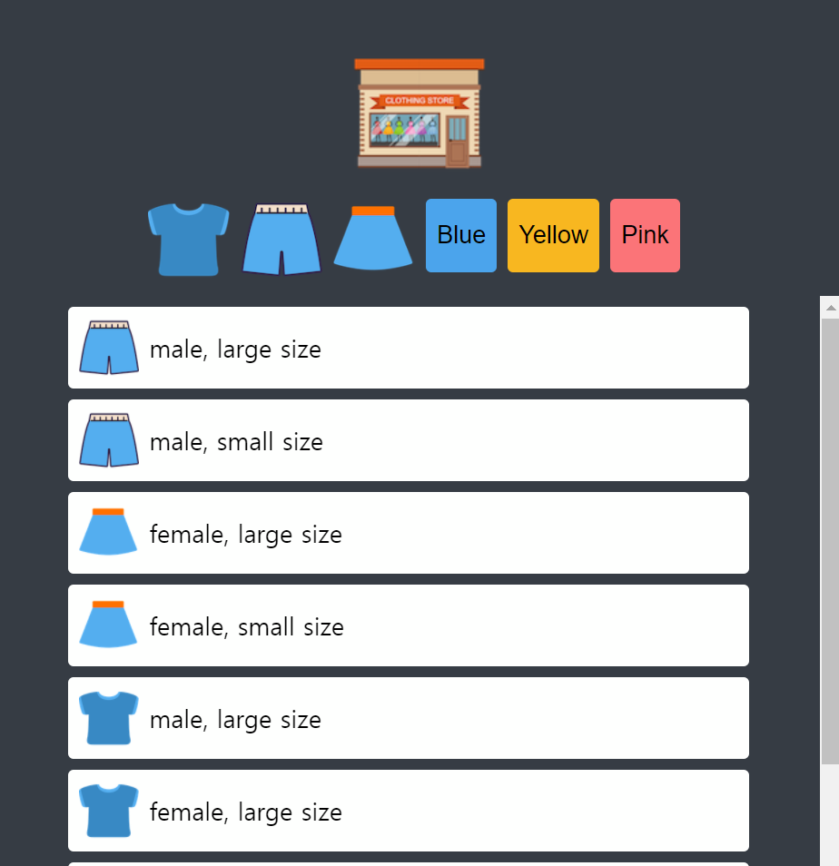
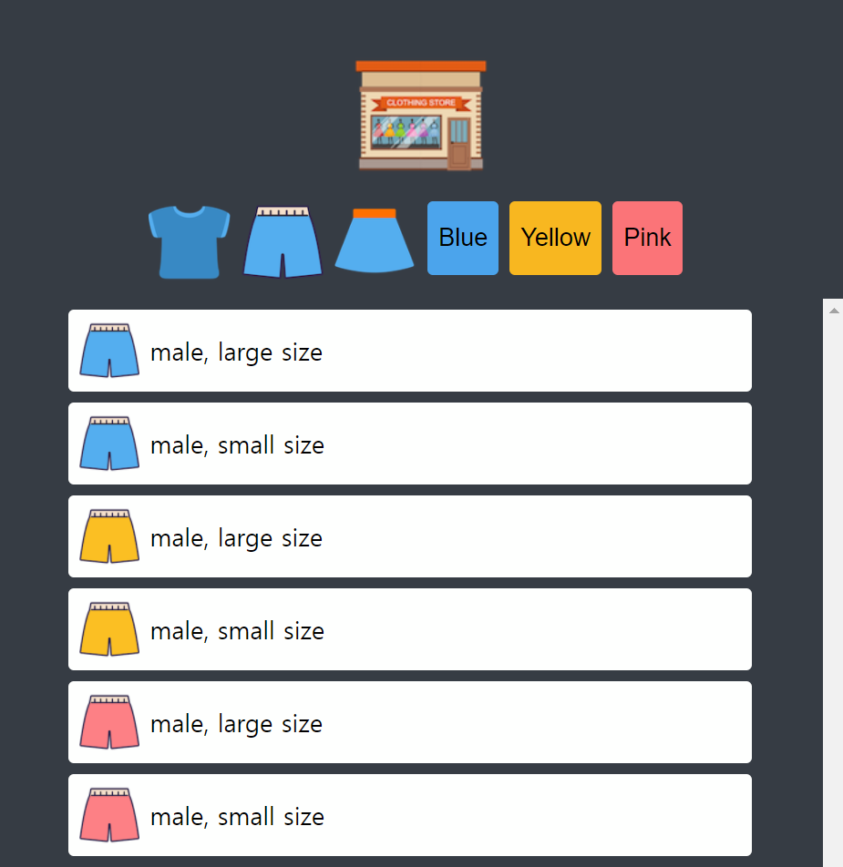
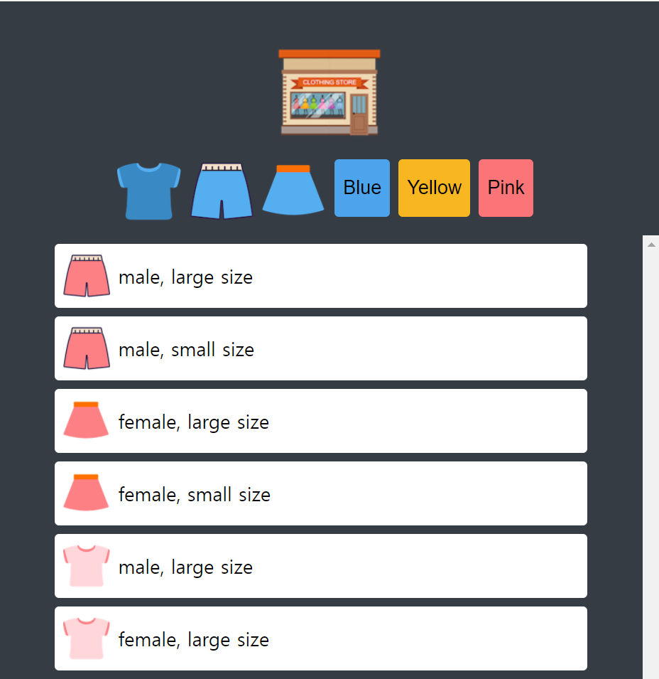
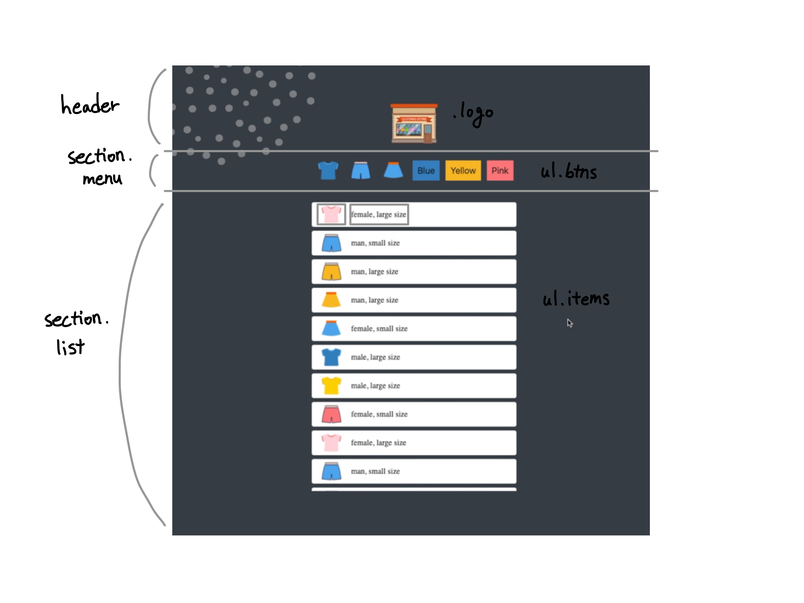

# Mini Online Shopping Mall
||||
|:-:|:-:|:-:|
|Home|Click the 'Pants' button|Click the 'Pink' button|

## About
미니 온라인 쇼핑몰 게임. 각 종류/색상 버튼 클릭 시 그에 해당하는 상품 목록이 분류되어 나타나고, 홈 버튼 클릭 시 다시 전체 상품 목록이 출력된다. JSON 파일을 연동하여 상품 데이터를 불러와서 사용했다.

## Stack
HTML, CSS, Vanilla JavaScript

## Period
2021.8.31. ~ 2021.8.31. (6h 30m)

## Roadmap
- [X] Wireframing

||
|:-:|

- [X] Scroll item list
- [X] Fetch the items from the JSON file
- [X] Filter items by type or color with buttons
- [X] Show all items when you click on the logo
